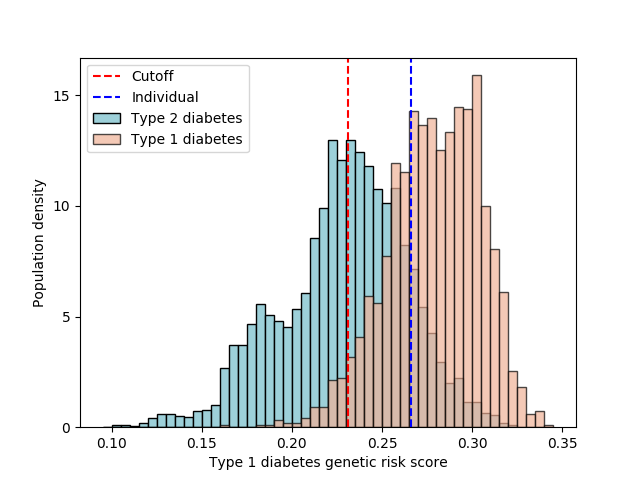

# Type 1 Diabetes Genetic Risk Score

Code for calculating an individual's T1D genetic risk score from their 23andMe data.

A genetic risk score (GRS) is a number that quantifies an individual's risk to developing a
particular disease or condition - in this case T1D. It combines the influence from multiple
genes into a single number. To make sense of the number it needs to be compared with a
statistical distribution of a cohort who are known to have T1D or T2D.

The papers below do two things:
1. identify a set of SNPs for calculating the T1D GRS
2. quantify the distribution of GRS for T1D and T2D cohorts and provide criteria to distinguish between them

The code in this repository will calculate an individual's GRS from their genetic data from 23andMe.

It is important to note that since we are dealing with probabilities, risk, and a propensity
to developing diabetes, the results of running the code will not give a definitive diagnosis.
If an individual has diabetes, the results _may_ help understand if T1D or T2D (or another type of diabetes)
is more likely, but it should never be a replacement for a professional doctor's opinion.

## Papers

[A Type 1 diabetes genetic risk score can aid discrimination between Type 1 and Type 2 diabetes in young adults][Oram], March 2016, Oram et al.

This paper identifies 30 SNPs to build a GRS for discriminating between T1D and T2D. Cohort size n=223,
comprised of white European individuals between 20 and 40.

[Frequency and phenotype of type 1 diabetes in the first six decades of life: a cross-sectional, genetically stratified survival analysis from UK Biobank][Thomas], February 2018, Thomas et al.

This paper uses the same SNPs from [Oram] (although one is excluded), but uses a much larger population size (n=379,511 individuals, white European,
under 60) to find a way of genetically determining T1D vs. T2D.

## Running the Code

First download your data from 23andMe. To do this, log in to the website, click on your name on the top right, click
"Browse Raw Data", then the Download tab. The data will be emailed to you in a zip file. Unzip it somewhere on
your computer; the result should be a text file. Mine was called `genome_Tom_White_v4_Full_20180302090932.txt`.

### Find missing SNPs from 23andMe using imputation

Unfortunately 23andMe doesn't have four SNPs (out of 29) that we need to run the analysis. However, there is a way of estimating
the missing SNPs using a process called *imputation* - the basic idea is that stretches of DNA in an individual tend
to be inherited together, so if you know some SNPs near the one you are interested in you can use those to estimate
the unknown one.

We'll use a tool called impute2 to do this, so [download and install it][impute2].

Set your path to include the impute2 binary (the one I used for Mac is below):

```bash
export PATH=$PATH:~/Downloads/impute_v2.3.2_MacOSX_Intel/
```

We'll use [these instructions][impute-23andme] (commands below) to convert the 23andMe SNP data into a format suitable for running
imputation. This includes downloading the 1000 Genomes reference data, which can take a while as it's several gigabytes
in size.

```bash
git clone https://github.com/johnlees/23andme-impute
cd 23andme-impute
curl -O https://mathgen.stats.ox.ac.uk/impute/ALL_1000G_phase1integrated_v3_impute.tgz
tar --strip-components=1 -zxf ALL_1000G_phase1integrated_v3_impute.tgz
rm ALL_1000G_phase1integrated_v3_impute.tgz
./impute_genome.pl -i /path/to/23andMeTextFile -o imputed -s m -w
cd ..
```

Finally, run imputation as follows:

```bash
./find-missing-snps-biobank.sh
```

If you look in the generated file `imputed-snps-biobank.gen` you should see the SNPs and the probabilities for each genotype.
The format of the file is described [here][impute_file_format], if you are interested.

### Running the analysis

You will need to have Python 2.7 installed on your computer, as well as the matplotlib dependency.
Install matplotlib by typing

```bash
pip install matplotlib
```

To run the analysis, type the following (where the path is the actual path on your machine to the unzipped file from 23andMe).

```bash
python t1d-grs-biobank.py /path/to/23andMeTextFile
```

The program will print the genetic risk score, and a summary of what can be inferred from it. The papers mentioned above
have more details about how to interpret the findings.

The program will also create a histogram of genetic risk scores (like Figure 1 from [Thomas]) with the genetic
risk score for your data marked on it, like this:



If the blue dashed line is to the right of the cutoff line (in red), like it is in the diagram above, then T1D is not
ruled out. If the blue line is to the left of the red line, then T1D is unlikely.

### Notes on the code

The file `analyses/grs-biobank.csv` contains the SNPs, their odds ratios and risk/effect alleles for the
analysis. This data was compiled from the papers referenced above.

The code in `t1d-grs-biobank.py` parses the CSV file and uses the alleles from the 23andMe data to calculate the GRS.
For the HLA SNPs (rs2187668 and rs7454108) the calculation is more complex, and the algorithm described on
[this blog post][diabetes_and_me] is used to find the risk scores for these SNPs.

The histograms were generated by first manually measuring the bars from the graphic in [Thomas] to create the
`data/dist.csv` file, then using this data to calculate where the individual's GRS appears in the distribution, and
plotting a histogram using matplotlib (see `hist.py`).

## More Analyses

### Five types of diabetes

[Novel subgroups of adult-onset diabetes and their association
 with outcomes: a data-driven cluster analysis of six variables][Ahlqvist], March 2018, Ahlqvist et al.
 
This paper proposes five types of diabetes that differ to the traditional type 1 and 2 distinctions. There is no
GRS in the paper, but there are 14 SNPs, with a different set of odds ratios for each type.

The following code will analyse an individual's 23andMe data and show how similar it is to each of the five types.

```bash
export PATH=$PATH:~/Downloads/impute_v2.3.2_MacOSX_Intel/
./find-missing-snps-5-types.sh
python t1d-grs-5-types.py /path/to/23andMeTextFile
```

## Other Papers

[Feature ranking of type 1 diabetes susceptibility genes improves prediction of type 1 diabetes][Winkler], December 2014, Winkler et al

[Ahlqvist]: https://www.thelancet.com/journals/landia/article/PIIS2213-8587(18)30051-2/fulltext
[Oram]: https://www.ncbi.nlm.nih.gov/pmc/articles/PMC5642867/
[Thomas]: https://www.thelancet.com/journals/landia/article/PIIS2213-8587%2817%2930362-5/fulltext?elsca1=tlxpr#sec1
[Winkler]: https://link.springer.com/article/10.1007%2Fs00125-014-3362-1
[impute2]: http://mathgen.stats.ox.ac.uk/impute/impute_v2.html
[impute-23andme]: https://leesjohn.wordpress.com/2014/03/18/impute-your-whole-genome-from-23andme-data/
[impute_file_format]: http://www.stats.ox.ac.uk/~marchini/software/gwas/file_format.html
[diabetes_and_me]:https://digitalsauna.wordpress.com/2017/12/02/diabetes-and-me/